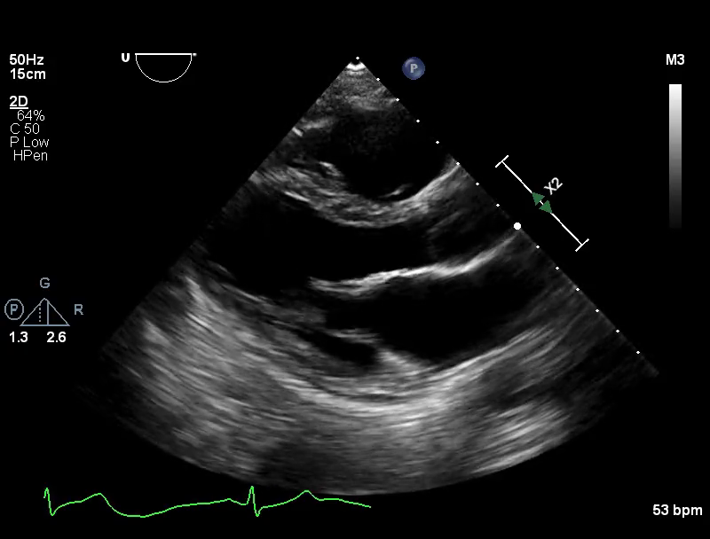
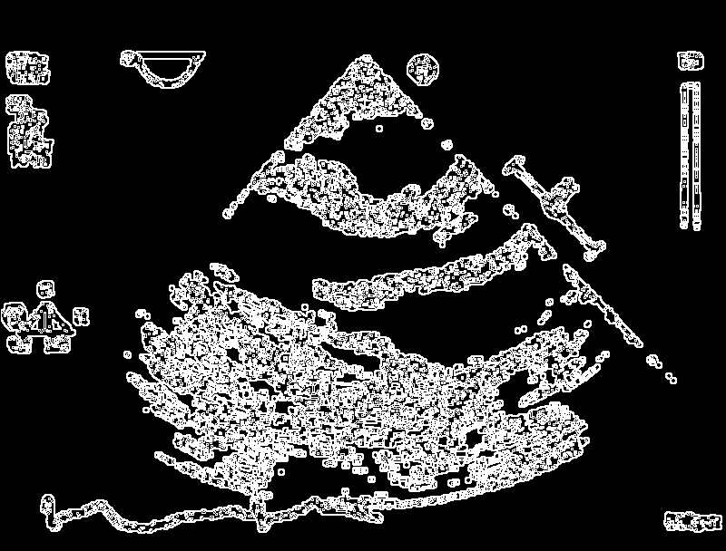

image pre processing utilities

## workspace structure

```
imgproc/
├── imgproc-core/      # stuff (types, traits, errors)
├── imgproc-ops/       # operations
├── imgproc-io/        # reading and writing files
├── imgproc-pipeline/  # yaml-based pipelines
├── imgproc-cli/       # command line tool
└── imgproc/           # the all in one main crate
```

## operations
1. ColorConvert (color.rs) - Convert between color spaces
2. Edge Detection (edges.rs)
    - Sobel - Gradient-based edge detection
    - Canny - Multi-stage edge detection with hysteresis
    - Prewitt - Simpler gradient operator
    - LaplacianOfGaussian - Blob detection via LoG operator
    - DifferenceOfGaussians - Fast LoG approximation
    - ZeroCrossing - Edge detection via zero-crossings (Laplacian, LaplacianOfGaussian)
3. Filtering Operations (filters.rs)
  - Smoothing
    - GaussianBlur - Gaussian smoothing
    - MedianFilter - Noise reduction preserving edges
    - BilateralFilter - Edge-preserving smoothing
    - BoxFilter - Fast uniform averaging
    - AnisotropicDiffusion - Perona-Malik edge-preserving diffusion
  - Edge Enhancement
    - Laplacian - Second derivative edge detection
      - Kernel types: Type4 (4-connected), Type8 (8-connected)
    - Scharr - Improved gradient with better rotational symmetry
    - UnsharpMask - Image sharpening
  - Other
    - GaussianDerivative - Derivatives of Gaussian (Orders: First, Second, Directions: X, Y, XX, XY, YY)
4. Geometric Transformations (geometry.rs)
    - Resize (scale images with interpolation: nearest, bilinear, bicubic, lanczos)
    - Crop
    - Rotate
5. Morphological Operations (morphology.rs)
    - Erode
    - Dilate
    - Opening (erosion → dilation)
    - Closing (dilation → erosion)
    - MorphGradient (Basic, Internal, External)
    - TopHat (White (bright features), Black (dark features))
    - Skeletonize - Zhang-Suen
    - Thinning (simplified)
    - HitOrMiss
6. Segmentation (segment.rs)
    - Threshold (Binary, BinaryInv, Truncate, ToZero, ToZeroInv)
    - OtsuThreshold
    - AdaptiveThreshold (Mean, Gaussian)
7. Histogram Operations (histogram.rs)
    - Histogram
    - HistogramEqualization
    - Clahe
    - HistogramMatching

## pipeline usage example:
```bash
cargo run --bin imgproc pipeline -c pipelines/edge_detection_strain.yaml -i input/effusion_plax~clusters~PEF00002-PLAX~US000002.mp4_pngs~0097.png -o output/strain_pipeline_12.png
```
  | Input | Output |
  |-------|--------|
  |  |  |
  
## api usage example:
```rust
use imgproc::prelude::*;

fn main() -> Result<()> {
    let input_path = "input/IMG-20251103-WA0001.jpg";
    let output_dir = "output";

    println!("Loading image: {}", input_path);
    let img_rgb = imgproc::io::read_image_rgb(input_path)?;
    println!("Image dimensions: {}x{}", img_rgb.width(), img_rgb.height());

    imgproc::io::write_image_rgb(&img_rgb, &format!("{}/original.png", output_dir))?;

    let img_gray = imgproc::ops::color::rgb_to_gray(&img_rgb)?;
    imgproc::io::write_image_gray(&img_gray, &format!("{}/grayscale.png", output_dir))?;

    let gaussian = GaussianBlur::new(7, 2.0)?;
    let blurred = gaussian.apply_gray(&img_gray)?;
    imgproc::io::write_image_gray(&blurred, &format!("{}/gaussian_blur.png", output_dir))?;

    let laplacian = Laplacian::new(LaplacianKernel::Type8, true)?;
    let laplacian_filtered = laplacian.apply_gray(&img_gray)?;
    imgproc::io::write_image_gray(&laplacian_filtered, &format!("{}/laplacian.png", output_dir))?;

    let unsharp = UnsharpMask::new(1.5, 2.0, 2)?;
    let sharpened = unsharp.apply_gray(&img_gray)?;
    imgproc::io::write_image_gray(&sharpened, &format!("{}/unsharp_mask.png", output_dir))?;

    let aniso = AnisotropicDiffusion::new(20, 15.0, 0.2, DiffusionOption::Option2)?;
    let aniso_result = aniso.apply_gray(&img_gray)?;
    imgproc::io::write_image_gray(&aniso_result, &format!("{}/anisotropic_diffusion.png", output_dir))?;

    let sobel = Sobel::new();
    let sobel_edges = sobel.apply_gray(&img_gray)?;
    imgproc::io::write_image_gray(&sobel_edges, &format!("{}/sobel_edges.png", output_dir))?;

    let canny = Canny::new(75.0, 150.0)?;
    let canny_edges = canny.apply_gray(&img_gray)?;
    imgproc::io::write_image_gray(&canny_edges, &format!("{}/canny_edges.png", output_dir))?;

    let prewitt = Prewitt::new();
    let prewitt_edges = prewitt.apply_gray(&img_gray)?;
    imgproc::io::write_image_gray(&prewitt_edges, &format!("{}/prewitt_edges.png", output_dir))?;

    let scharr = Scharr::new(false);
    let scharr_edges = scharr.apply_gray(&img_gray)?;
    imgproc::io::write_image_gray(&scharr_edges, &format!("{}/scharr_edges.png", output_dir))?;

    let opening = MorphOpen::new(5, StructuringElement::Ellipse)?;
    let opened = opening.apply_gray(&binary_otsu)?;
    imgproc::io::write_image_gray(&opened, &format!("{}/morph_open.png", output_dir))?;

    Ok(())
}
```
